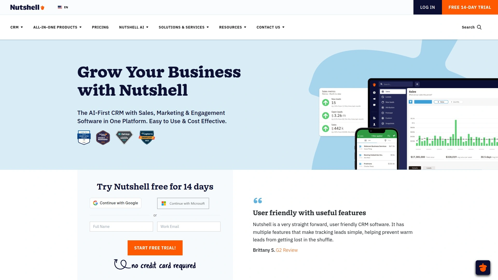
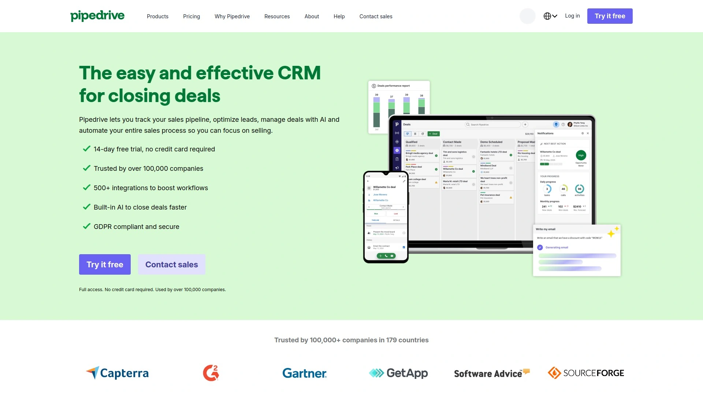
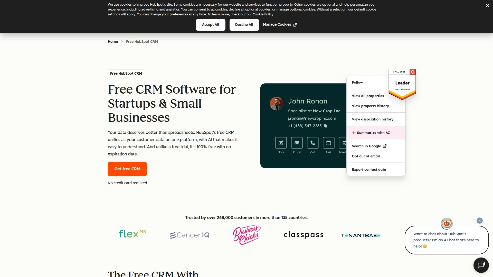
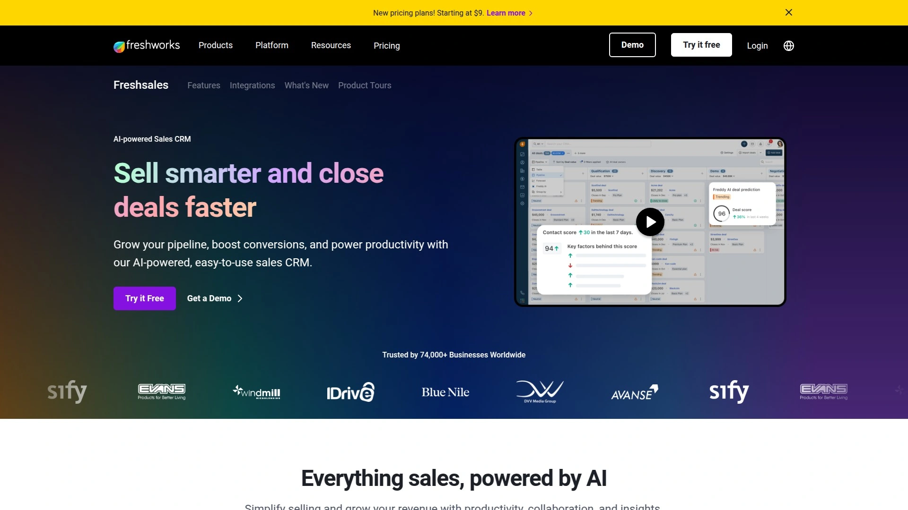
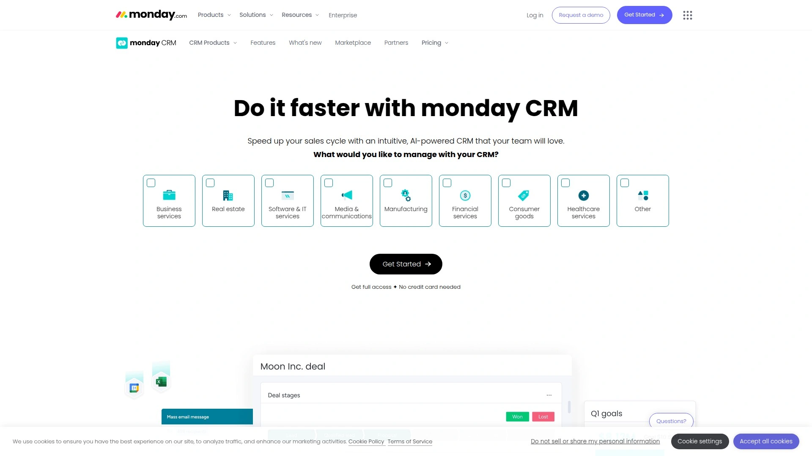
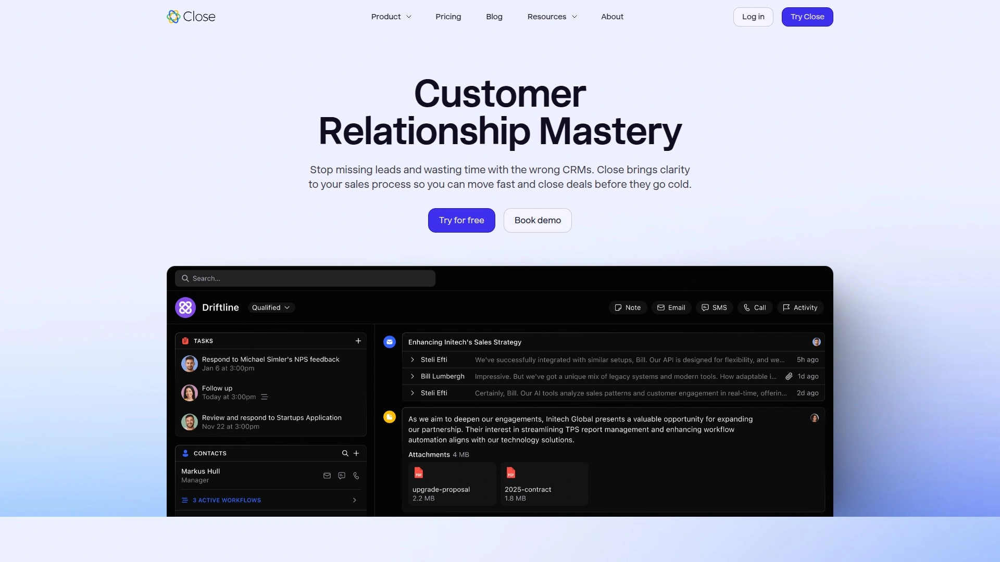

# Latest CRM Software Roundup (Including Detailed Reviews)

Managing sales relationships through scattered spreadsheets and sticky notes kills deals before they start. Whether you're tracking warm leads, nurturing prospects, or closing repeat business, modern CRM software centralizes customer data and automates follow-ups—so nothing falls through the cracks while your team focuses on actual selling.

***

## **[Nutshell](https://www.nutshell.com)**

Simple pipeline management that feels like it was designed by salespeople, not engineers.

Nutshell delivers straightforward CRM functionality without overwhelming users with unnecessary complexity. The platform combines contact management, sales pipeline tracking, email marketing, and reporting tools in one clean interface that new team members learn within minutes rather than weeks.

**What makes it click:** The visual pipeline displays every deal stage clearly, letting you drag opportunities through your sales process while automated reminders prevent leads from going cold. Contact records automatically capture email conversations, files, and interaction history—creating complete customer profiles without manual data entry.

Built-in email marketing tools enable targeted campaigns directly from the CRM. Create segmented lists based on pipeline stage, send personalized drip sequences, and track open rates without paying for separate software. Landing page builders and web forms capture new leads that flow automatically into your sales funnel.

**Automation advantages** include workflow triggers that notify reps when prospects open proposals, automated follow-up sequences for different lead types, and scheduled email campaigns that nurture relationships over time. These features come standard rather than requiring expensive add-ons.

Reporting dashboards surface the metrics that matter—conversion rates by stage, average deal velocity, revenue forecasts, and individual rep performance. Export data or share live reports with stakeholders who need visibility without CRM access.

Customer support stands out with live assistance available to all users regardless of plan level. The team helps migrate existing data during onboarding and provides ongoing strategy advisement rather than just technical troubleshooting.

Pricing starts affordably for small teams while scaling smoothly as businesses grow. Companies report 14.9% faster close times, 13.4% more leads won, and 26.4% revenue increases after implementing Nutshell—results driven by better organization rather than adding complexity.

Best suited for growing businesses seeking comprehensive functionality with gentle learning curves—teams tired of wrestling with overcomplicated enterprise systems or outgrowing basic contact managers.

## **[Pipedrive](https://www.pipedrive.com)**

Visual pipeline management that keeps sales teams laser-focused on moving deals forward.

Pipedrive built its reputation on the cleanest, most intuitive pipeline visualization in the industry. The platform centers everything around visual deal tracking, making it immediately obvious which opportunities need attention and which stages bottleneck your sales process.

Customizable pipeline stages match your actual sales workflow rather than forcing generic processes. Drag deals between stages, set probability percentages, and watch revenue forecasts update automatically. The interface feels more like project management than traditional database-heavy CRMs.

**Smart features include** automatic deal rotation distributing incoming leads fairly across team members, customizable workflows eliminating repetitive manual tasks, and activity reminders ensuring follow-ups happen on schedule. Email integration logs conversations automatically while tracking opens and clicks.

Team collaboration tools provide shared inboxes for group email management, @mentions for flagging colleagues, and shared calendars coordinating meetings. Assign tasks, track progress, and communicate within the platform rather than switching to separate tools.

Reporting and analytics deliver detailed insights into pipeline health. Monitor conversion rates between stages, measure deal velocity, analyze sales cycle length, and identify which activities correlate with closed deals. Forecasting features and goal-setting capabilities help teams set realistic targets based on historical performance.

Mobile apps enable pipeline management from anywhere—update deal stages, log activities, and respond to prospects without laptop access. The responsive design maintains full functionality across devices.

Integration ecosystem connects with hundreds of business tools through native connections and Zapier. Sync contacts with email platforms, connect calendars, integrate marketing automation, and push closed deals into accounting systems.

Pricing begins at $11.90 per user monthly, positioning Pipedrive among the most affordable full-featured CRMs. The investment makes sense for sales-focused teams prioritizing pipeline visibility over extensive feature bloat.

## **[Zoho CRM](https://www.zoho.com/crm/)**

Customizable powerhouse that scales from solopreneur to enterprise without breaking budgets.

Zoho CRM combines enterprise-level functionality with small business pricing through a modular platform that grows alongside your needs. The generous free plan includes genuine utility for up to three users, while paid tiers unlock automation, AI assistance, and deep customization.

**Omnichannel capabilities** manage customer interactions across email, social media, live chat, and phone from one unified interface. Conversations flow into contact timelines regardless of channel, preventing the fragmentation that happens when communications scatter across multiple platforms.

Customization flexibility allows creating custom fields, modules, and process flows without coding knowledge. Blueprint feature enforces your specific sales methodology by guiding reps through standardized steps for different deal types. Workflow automation handles repetitive tasks—assigning leads, sending follow-ups, updating fields, and triggering notifications.

Zia AI assistant provides intelligent features like lead scoring predicting conversion likelihood, sentiment analysis gauging customer emotions in communications, and anomaly detection flagging unusual patterns. AI-powered recommendations suggest next actions based on successful patterns.

**Integration advantages** shine through tight connections with other Zoho apps—Campaigns for marketing automation, Desk for customer service, SalesIQ for live chat, and dozens more. This ecosystem provides enterprise capabilities at fraction of typical costs. Third-party integrations extend functionality to popular business tools.

Reporting and dashboards offer deep customization for tracking metrics that matter to your business. Create custom reports, schedule automated delivery, and build visual dashboards monitoring KPIs in real-time.

The learning curve requires time investment—Zoho's extensive feature set takes longer to master than simpler alternatives. However, this complexity enables building exactly the CRM your business needs rather than accepting one-size-fits-all limitations.

Pricing starts at $14 per user monthly for standard features, with professional and enterprise tiers adding advanced automation and analytics. The free forever plan provides legitimate functionality for very small teams testing CRM concepts.

## **[HubSpot CRM](https://www.hubspot.com/products/crm)**

The free CRM that actually delivers value while upselling premium marketing and sales tools.

HubSpot pioneered the freemium CRM model with a genuinely useful free tier that never expires. The platform provides unlimited users, contacts, and data storage at zero cost—removing the typical constraints forcing upgrades before you're ready.

Free features include contact management with automatic company enrichment, deal pipeline tracking, email tracking showing opens and clicks, meeting scheduling eliminating back-and-forth, live chat for website visitors, and basic reporting. These capabilities match or exceed what many competitors charge for.

**Why it stays free:** HubSpot monetizes through optional Marketing Hub, Sales Hub, and Service Hub upgrades adding automation, advanced analytics, and sophisticated tools as businesses scale. The CRM foundation remains free, creating a logical upgrade path rather than forced migration.

Email templates and sequences enable personalized outreach at scale. Create reusable templates, track engagement metrics, and set up automated follow-up sequences triggered by prospect behavior. These features help small teams punch above their weight.

Pipeline management provides visual deal tracking with customizable stages matching your sales process. Forecasting tools predict revenue based on deal probability and historical close rates, helping managers plan resources realistically.

Integration ecosystem connects with 1,900+ business applications through native connections and marketplace apps. Sync with Gmail and Outlook, connect marketing tools, push data to analytics platforms, and automate workflows across your tech stack.

**Upgrade considerations:** While the free CRM excels, advanced features like marketing automation, custom reporting, and sophisticated workflows require paid plans starting around $20 per user monthly. Teams eventually outgrow free limitations as needs increase.

The platform suits businesses wanting proven enterprise CRM technology without immediate investment—perfect for testing concepts before committing budgets. HubSpot's brand recognition and extensive resources provide confidence for decision-makers evaluating options.

## **[Freshsales](https://www.freshworks.com/crm/sales/)**

AI-powered sales CRM delivering enterprise features at entry-level prices.

Freshsales competes aggressively on pricing while packing AI-driven insights, automation, and multichannel communication into plans starting at just $9 per user monthly. This positions it as the most affordable full-featured CRM across major providers.

**Freddy AI** provides intelligent lead scoring predicting conversion likelihood, deal insights surfacing opportunities needing attention, and contact scoring identifying high-value relationships. These AI capabilities typically cost significantly more with competing platforms.

Built-in communication tools include phone, email, chat, and SMS—all accessible within the CRM interface. Make calls directly from contact records with automatic logging, send tracked emails monitoring opens and clicks, and engage prospects through their preferred channels.

Visual pipeline management displays deals through customizable stages with drag-and-drop simplicity. Set up multiple pipelines for different product lines or sales processes, with each maintaining independent tracking and forecasting.

**Automation capabilities** handle workflow triggers, automated task assignments, email sequences, and field updates based on conditions you define. Even the entry-level Growth plan includes basic automation, though advanced workflows require higher tiers.

The tiered structure creates significant jumps between plans—Growth at $9 lacks features like custom reports and extensive API access, while Pro at $39 quadruples the price. This gap forces growing businesses into expensive upgrades sooner than ideal.

Integration options connect with popular business tools, though the selection feels more limited compared to established players like HubSpot or Salesforce. Native integrations cover essentials while Zapier extends compatibility.

Free plan supports up to three users with basic CRM functionality—sufficient for tiny teams validating concepts but lacking automation and advanced features. The 21-day trial period exceeds industry standard, providing ample evaluation time.

Best suited for cost-conscious small businesses prioritizing AI capabilities and multichannel communication at lowest possible investment. Teams needing sophisticated customization may outgrow limitations faster.

## **[Monday.com CRM](https://monday.com/crm)**

Highly visual, fully customizable CRM built on flexible Work OS foundation.

Monday.com approaches CRM differently by providing a customizable canvas rather than rigid predefined structures. The platform adapts to your exact processes through 27+ views, 36+ column types, and 25+ widgets—creating CRM experiences matching how your team actually works.

**Visual flexibility shines** through kanban boards, timeline views, calendar layouts, maps, charts, and traditional tables. Switch perspectives instantly to view pipeline stages as cards, plot deals on timelines, or analyze performance through dashboards. This visual approach makes data more digestible than text-heavy interfaces.

Automation builder creates workflows without coding—send notifications when deals reach stages, assign tasks based on conditions, update fields automatically, and trigger actions across connected tools. The system handles repetitive busywork so reps focus on relationships.

Activity management logs phone calls, emails, social media interactions, and meetings in unified contact timelines. Track every touchpoint comprehensively, providing 360-degree customer views that prevent information gaps between team members.

**Tracking capabilities** extend beyond basic CRM into order management, invoice creation, email metrics monitoring, and lead qualification automation. Set parameters defining qualified leads, then let the system categorize and route opportunities automatically.

Customizable dashboards bring customer data to life through intuitive visualizations. Filter and organize information by relevant metrics, creating views for different roles—sales leadership sees forecasts while reps focus on their active deals.

The flexibility creating Monday.com's strength also introduces complexity. Unlike purpose-built CRMs with predefined best practices, Monday.com requires thoughtful setup designing your ideal workflows. Teams gain power but sacrifice plug-and-play simplicity.

Integration ecosystem connects with popular business applications, extending functionality across your tech stack. Native connections and Zapier support enable data synchronization with email platforms, accounting systems, and marketing tools.

Pricing reflects the platform's position as comprehensive work management solution rather than CRM-only tool. Plans scale based on features and team size, with costs competitive for businesses valuing flexibility over specialized CRM features.

## **[Close](https://www.close.com)**

The no-BS inside sales CRM that keeps remote teams selling instead of administrating.

Close targets inside sales teams and remote sellers with built-in calling, email, and SMS—eliminating the tool-switching that fragments conversations across platforms. Everything happens within the CRM, creating seamless workflows where reps stay focused on prospects rather than administrative tasks.

**Communication efficiency** stems from native integrations—make calls through VoIP without separate systems, send tracked emails monitoring engagement, and text prospects directly from contact records. All interactions log automatically, building complete conversation histories without manual entry.

AI-powered automation captures call and meeting notes intelligently, writes email follow-ups based on conversation context, and surfaces insights about deal status. These features reduce administrative burden significantly, letting reps handle more opportunities simultaneously.

Automated workflows operate 24/7 keeping outreach consistent. Set up sequences combining calls, emails, and tasks that execute based on prospect behavior—opened emails trigger follow-ups, missed calls schedule retry attempts, and unresponsive leads receive re-engagement campaigns.

**Customization flexibility** allows configuring automation rules matching your unique sales methodology. Create workflows based on specific lead behaviors, pipeline movements, or custom triggers you define. Templates provide starting points while supporting complete customization.

Pipeline management provides clear visibility into deal stages with automated reminders ensuring opportunities don't stall. Smart insights and AI-powered guidance suggest next actions, reducing guesswork about optimal follow-up timing and approach.

The platform suits high-velocity inside sales environments where reps handle numerous conversations daily. Remote teams particularly benefit from unified communication eliminating the chaos of managing calls through one system, emails through another, and CRM updates separately.

Integration options connect Close with popular tools through Zapier, Slack, and Gmail. While the integration library feels smaller than established competitors, the built-in communication features reduce reliance on external tools.

Pricing starts at $29 per user monthly with 14-day free trial. The investment makes sense for teams prioritizing communication efficiency over extensive feature breadth, particularly inside sales operations with high daily activity volumes.

## **[Insightly](https://www.insightly.com)**

CRM-plus-project-management hybrid bridging sales and delivery teams seamlessly.

Insightly stands out by combining traditional CRM functionality with robust project management capabilities. This dual focus eliminates the gap between winning deals and delivering results, ensuring customer context flows smoothly from sales through execution.

**Opportunity-to-project conversion** happens with one click—after closing a deal, transform it into a project automatically carrying over specifications, client requirements, tasks, and associated details. Delivery teams inherit complete customer context without manual handoffs or information gaps.

Customizable pipelines serve both sales and project delivery workflows. Sales teams track opportunities through standard deal stages while project teams manage execution through customized delivery pipelines matching their unique processes. Each maintains independent tracking suited to their specific needs.

Milestone tracking provides transparency ensuring everyone understands project progress. Set key markers throughout delivery lifecycle, communicate status clearly with clients, and track progress precisely against agreed timelines.

**Customization depth** allows creating custom fields capturing project-specific information beyond standard options, and designing page layouts displaying relevant data prominently for different team roles. This adaptability ensures the system aligns with industry-specific workflows rather than forcing generic processes.

Task management features assign work, set deadlines, create dependencies, and track completion across team members. Collaboration tools centralize communication, eliminating scattered threads across email, chat, and project management tools.

The platform suits professional services firms, agencies, consultancies, and businesses where project delivery follows sales. Teams benefit from unified client views spanning initial outreach through completed work.

AI capabilities have been added recently, though the platform's core strength remains the CRM-project management integration rather than cutting-edge AI features.

Pricing reflects the dual-purpose functionality, with plans accommodating various business sizes from small teams through enterprises requiring extensive customization and support.

## **[Copper](https://www.copper.com)**

The only CRM built exclusively for Google Workspace that feels native to Gmail.

Copper earns "Recommended for Google Workspace" status by functioning seamlessly within Gmail, Calendar, and other Google apps. The platform requires zero data entry—records populate automatically from Gmail conversations, creating effortless CRM management for Google-centric businesses.

**Native integration magic** means contacts, leads, and accounts appear automatically as you email people. Files and Google Docs attached to emails link automatically to relevant records. The system tracks relationship history without anyone manually updating fields.

Managing relationships happens directly from Gmail through Copper's sidebar interface. View contact details, check pipeline status, log activities, and update deals without leaving your inbox. The interface matches Google Workspace aesthetics exactly—no learning curve for users familiar with Gmail.

Pipeline management tracks opportunities through customizable stages with visual boards or list views. Automated workflows handle follow-ups, reminders, and email sequences, ensuring leads never slip through cracks despite busy schedules.

**Implementation speed** sets Copper apart—teams get running in minutes rather than weeks. All data automatically populates from Gmail upon connection, with simple configuration from there. No expensive consultants or endless customization projects before launching.

The Chrome extension adds CRM functionality directly within LinkedIn, letting you save contacts and log interactions without switching contexts. This proves valuable for relationship-building businesses where LinkedIn plays central roles.

Automation capabilities streamline business processes through email automation, automated follow-ups, reminders, and sequences keeping projects and client relationships moving forward without manual intervention.

Best suited for businesses deeply embedded in Google Workspace seeking CRM that works with their existing habits rather than forcing new workflows. Teams wanting to avoid traditional CRM complexity while gaining organization and automation.

Integration options extend Copper's reach beyond Google apps to other business tools, though the platform's core value proposition centers on Google ecosystem excellence rather than universal integration breadth.

***

## FAQ

**Which CRM offers the best value for small businesses just starting out?**

HubSpot's free tier provides unlimited users and contacts with no expiration, making it ideal for testing CRM concepts without investment. Zoho CRM offers a free plan for three users with robust features, while Nutshell and Freshsales deliver comprehensive paid functionality starting under $10 per user monthly.

**How do I choose between specialized CRMs and all-in-one platforms?**

Specialized CRMs like Close excel for inside sales teams needing built-in calling, while all-in-one platforms like Insightly suit businesses requiring project management alongside sales tracking. Consider your primary pain points—communication fragmentation favors specialized tools, while cross-functional collaboration benefits from unified platforms.

**What's the easiest CRM for teams with no technical experience?**

Pipedrive and Nutshell win for intuitive visual interfaces requiring minimal training. Copper offers zero learning curve for Google Workspace users since it operates within familiar Gmail. All three prioritize simplicity over feature complexity, helping teams adopt CRM habits quickly.

***

## Finding Your Perfect CRM Match

The eight platforms above approach customer relationship management from different angles—some prioritize visual pipelines while others emphasize communication integration or project delivery—but they all eliminate the chaos of scattered customer data. [Nutshell](https://www.nutshell.com) excels for growing businesses seeking comprehensive functionality without overwhelming complexity, particularly when teams need clean pipeline visibility, built-in email marketing, and responsive support without paying enterprise prices. The straightforward interface reduces onboarding time dramatically while automated workflows and contact management prevent leads from disappearing, helping companies achieve measurably faster close times and increased revenue through better organization rather than added complexity.
